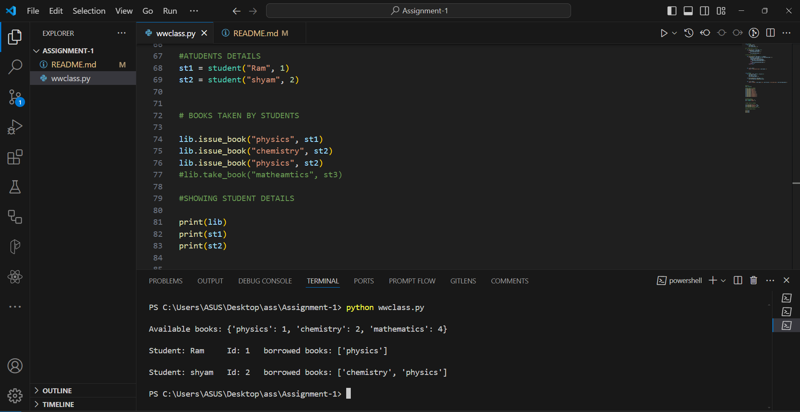

# Assignment-1
Uses of class and objects in python

Question:
Create two classes named Library and Student, add some functionality like: adding new book in the library, checking number of books taken by a each student 


## How to Run:
To run this, 
- Install code editors from [Here](https://code.visualstudio.com/download)


- open that folder in VSCode 

- Open command prompt and run following command 
```https 
  python wwclass.py
``` 


 

## Output :


### Feedback

If you have any feedback, please reach out to me at yogendrabaskota18@gmail.com 
